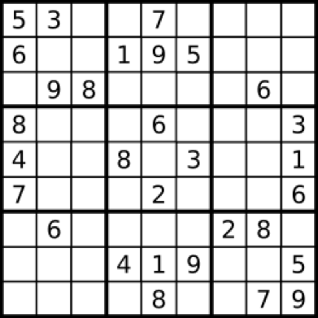

# LC36. Valid Sudoku

### LeetCode

## Question

Determine if a Sudoku is valid, according to: <a href="http://sudoku.com.au/TheRules.aspx">Sudoku Puzzles - The Rules</a>.

The Sudoku board could be partially filled, where empty cells are filled with the character `.`.



A partially filled sudoku which is valid.

**Note:**

A valid Sudoku board (partially filled) is not necessarily solvable. Only the filled cells need to be validated.

## Solutions

### Solution 1

* C++
```
bool isValidSudoku(vector<vector<char>>& board) {
    vector<vector<bool>> row(9, vector<bool>(9));
    vector<vector<bool>> col(9, vector<bool>(9));
    vector<vector<bool>> square(9, vector<bool>(9));
    for(int i=0; i<9; ++i)
    {
        for(int j=0; j<9; ++j)
        {
            if(board[i][j] != '.')
            {
                int num = board[i][j]-'1';
                int squth = (i/3)*3 + j/3;
                if(row[i][num] || col[j][num] || square[squth][num])
                    return false;
                row[i][num] = col[j][num] = square[squth][num] = true;
            }
        }
    }
    return true;
}
```

* Using row[i][num] to represent the num<sup>th</sup> number of i<sup>th</sup> row was occupied.
* Using col[j][num] to represent the num<sup>th</sup> number of j<sup>th</sup> colum was occupied.
* Using square[squth][num] to represent the num<sup>th</sup> number of squ<sup>th</sup> square was occupied.

`(i/3)*3` is to find the row<sup>th</sup> of the square; `j/3` is to find the colum<sup>th</sup> of the square.

When check a number in the `board`, if found any exsiting occupied number, we can sure it's unvalid sudoku.

**Complexity:**

* **worst-case time complexity:** O(n<sup>2</sup>), where `n` is the height or width of the `board`.
* **worst-case space complexity:** O(n<sup>2</sup>), where `n` is the height or width of the `board`.

