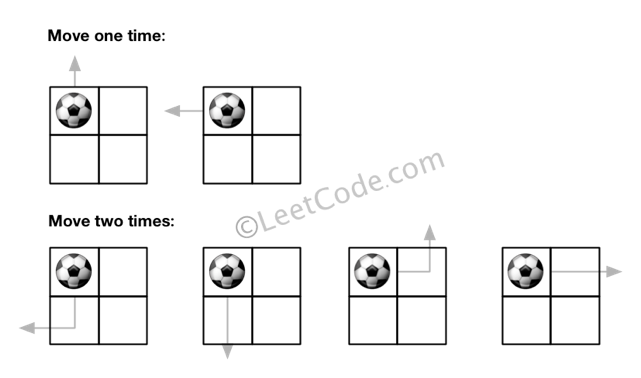
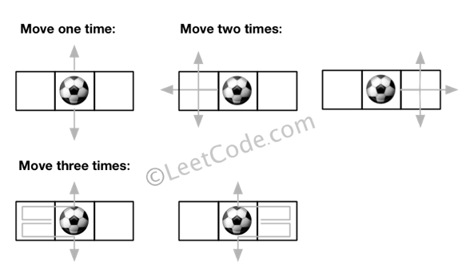

# LC576. Out of Boundary Paths

### LeetCode

## Question

There is an m by n grid with a ball. Given the start coordinate (i,j) of the ball, you can move the ball to adjacent cell or cross the grid boundary in four directions (up, down, left, right). However, you can at most move N times. Find out the number of paths to move the ball out of grid boundary. The answer may be very large, return it after mod 10<sup>9</sup> + 7.

**Example 1:**

```
Input:m = 2, n = 2, N = 2, i = 0, j = 0
Output: 6
```

* Explanation:



**Example 2:**

```
Input:m = 1, n = 3, N = 3, i = 0, j = 1
Output: 12
```

* Explanation:



**Note:**

1.	Once you move the ball out of boundary, you cannot move it back.
2.	The length and height of the grid is in range [1,50].
3.	N is in range [0,50].

## Solutions

### Solution 1

* C++ (TLE)
```
int findPaths(int m, int n, int N, int i, int j) {
    if(i<0 || i==m || j<0 || j==n)
    {
        if(N>=0) return 1;
        return 0;
    }
    if(N<=0) return 0;
    int res = 0;
    if(i>=0) res += findPaths(m,n,N-1,i-1,j); // 0+(10<sup>9</sup> + 7) will not larger than (10<sup>9</sup> + 7).
    if(i<m) res = (res + findPaths(m,n,N-1,i+1,j)) % bound;
    if(j>=0) res = (res + findPaths(m,n,N-1,i,j-1)) % bound;
    if(j<n) res = (res + findPaths(m,n,N-1,i,j+1)) % bound;
    return res;
}
```

Using DFS starting from (i, j), and count all possible out of boundary.

**Complexity:**

* **worst-case time complexity:** O(4<sup>N</sup>), where `N` is the most move times.
* **worst-case space complexity:** `O(N)`, where `N` is the most move times.

### Solution 2

* C++ (TLE)
```
class Solution {
public:
    int DFS(int m, int n, int N, int i, int j, vector<vector<vector<int>>>& dp)
    {
        if(i<0 || i==m || j<0 || j==n)
        {
            if(N>=0) return 1;
            return 0;
        }
        if(N<=0 || i>N && m-i>N && j>N && n-j>N) 
        {
            dp[i][j][N] = -1;
            return 0;
        }
        if(dp[i][j][N]==-1) return 0;
        if(dp[i][j][N] > 0) return dp[i][j][N];
        
        int res = 0;
        if(i>=0) res += findPaths(m,n,N-1,i-1,j);
        if(i<m) res = (res + findPaths(m,n,N-1,i+1,j)) % bound;
        if(j>=0) res = (res + findPaths(m,n,N-1,i,j-1)) % bound;
        if(j<n) res = (res + findPaths(m,n,N-1,i,j+1)) % bound;
        dp[i][j][N] = res;
        return res;
    }

    const int bound = (1e9) + 7;

    int findPaths(int m, int n, int N, int i, int j) {
        vector<vector<vector<int>>>dp(m, vector<vector<int>>(n, vector<int>(N+1)));
        return DFS(m,n,N,i,j,dp);
    }
};
```

Using DFS with DP. `dp[i][j][N]` is to represent the possible out of boundary given `N` steps starting from `(i, j)`. It reduces some re-calculating, but seems still too slow for the test cases.

* **worst-case space complexity:** `O(m * n * N)`, where `N` is the most move times.


### Solution 3

* C++
```
int findPaths(int m, int n, int N, int i, int j) {
    const int bound = (1e9) + 7;
    vector<vector<vector<int>>>dp(m, vector<vector<int>>(n, vector<int>(N+1)));
    for(int Ni=1; Ni<=N; ++Ni)
        for(int mi=0; mi<m; ++mi)
            for(int nj=0; nj<n; ++nj)
            {
                int res = (mi==0)? 1 : dp[mi-1][nj][Ni-1];
                res = (res + ((mi==m-1)? 1 : dp[mi+1][nj][Ni-1])) % bound;
                res = (res + ((nj==0)? 1 : dp[mi][nj-1][Ni-1])) % bound;
                res = (res + ((nj==n-1)? 1 : dp[mi][nj+1][Ni-1])) % bound;
                dp[mi][nj][Ni] = res;
            }
    return dp[i][j][N];
}
```

Using iteration instead of DFS.

* **worst-case time complexity:** O(m * n * N), where `N` is the most move times.
* **worst-case space complexity:** `O(m * n * N)`, where `N` is the most move times.