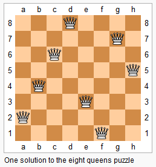

# N-Queens II

### LeetCode

## Question

Follow up for <a href="">N-Queens</a> problem.

Now, instead outputting board configurations, return the total number of distinct solutions.



## Solutions
* C++1
```bash
int DFS(vector<vector<bool>>& mem, int row, int n)
    {
        if(row==n) return 1;
        int res = 0;
        for(int i=0; i<n; ++i)
        {
            if(mem[0][i]==false && mem[1][row+i]==false && mem[2][n+i-row]==false)
            {
                mem[0][i]=mem[1][row+i]=mem[2][n+i-row]=true;
                res += DFS(mem, row+1, n);
                mem[0][i]=mem[1][row+i]=mem[2][n+i-row]=false;
            }
        }
        return res;
    }
    int totalNQueens(int n) {
        vector<vector<bool>> mem(3, vector<bool>(2*n-1));
        // vector<int> col(n), main(2*n-1), anti(2*n-1); // int is more effective than bool
        return DFS(mem, 0, n);
    }
```
