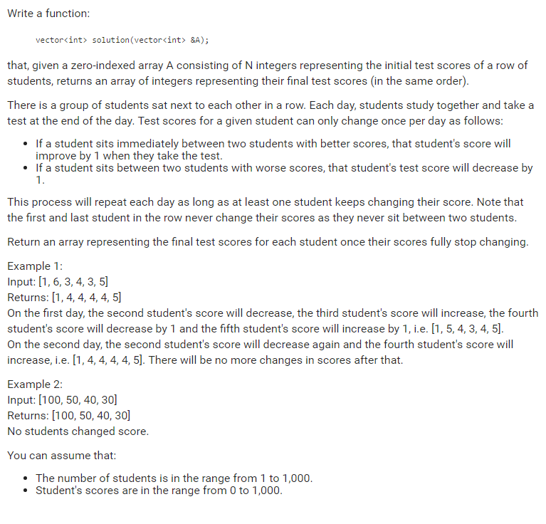

# Codility. Update Scores

### Codility

## Question



## Solutions

* C++1
```
vector<int> updateScores(vector<int> & A){
    bool update = true;
    while(update){
        int temp = A[0];
        bool chage = false;
        for(unsigned int i=1; i<A.size()-1; ++i){
            if((A[i] - temp) * (A[i] - A[i+1]) > 0){
                chage = true;
                A[i] = (A[i] > A[i+1]) ? A[i]-1 : A[i]+1;
            }
            temp = A[i];
        }
        update = chage;
    }
    return A;
}
```

## Explanation

Update from left to right except the first and the end scores.

Update a score, but keep the original score in a temp.

If a chage happened, update all scores again.

* **worst-case time complexity:** O(n<sup>2</sup>)
* **worst-case space complexity:** O(1)

## Test cases

* [1]
* [1,1]
* [0]
* [0,0]
* [1000]
* [1000,1000]
* [0,1000]
* [0, 1000, 1000]
* [0, 1000, 0]
* [1000, 0, 1000]
