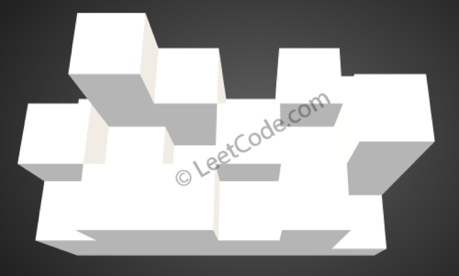
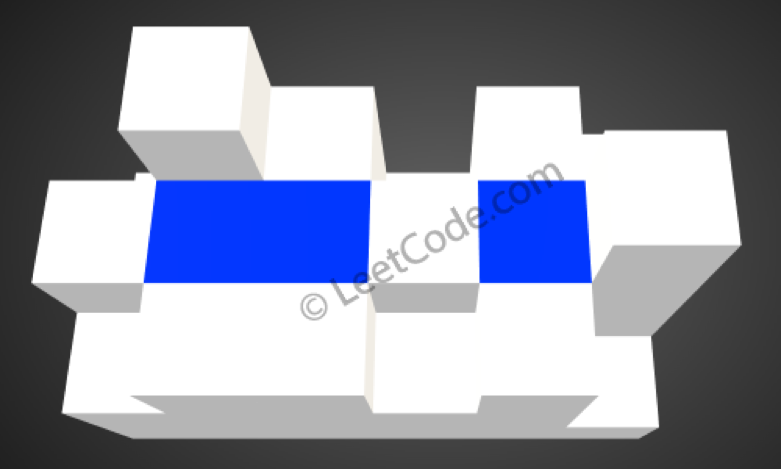

# LC407. Trapping Rain Water II

### LeetCode

## Question

Given an `m x n` matrix of positive integers representing the height of each unit cell in a 2D elevation map, compute the volume of water it is able to trap after raining.

**Note:**

Both m and n are less than 110. The height of each unit cell is greater than 0 and is less than 20,000.

**Example:**

```
Given the following 3x6 height map:
[
  [1,4,3,1,3,2],
  [3,2,1,3,2,4],
  [2,3,3,2,3,1]
]
```

Return 4.



The above image represents the elevation map `[[1,4,3,1,3,2],[3,2,1,3,2,4],[2,3,3,2,3,1]]` before the rain.



After the rain, water are trapped between the blocks. The total volume of water trapped is 4.

## Solutions

* C++1
```
class Solution {
public:
    struct Cell{
        int row;
        int col;
        int height;
        Cell(int r, int c, int h) : row(r), col(c), height(h) {}
    };
    int trapRainWater(vector<vector<int>>& heightMap) {
        auto myComp = []( Cell a, Cell b ) { return a.height > b.height; };
        priority_queue<Cell, vector<Cell>, decltype(myComp)> pq(myComp); //the  cell with lowest height to appear as the top()
        int h = heightMap.size();
        int w = (h>0) ? heightMap[0].size() : 0;
        vector<vector<bool>> visited(h, vector<bool>(w));
        for(int j=0; j<w; ++j)
        {
            visited[0][j] = visited[h-1][j] = true;
            pq.push(Cell(0, j, heightMap[0][j]));
            pq.push(Cell(h-1, j, heightMap[h-1][j]));
        }
        for(int i=0; i<h; ++i)
        {
            visited[i][0] = visited[i][w-1] = true;
            pq.push(Cell(i, 0, heightMap[i][0]));
            pq.push(Cell(i, w-1, heightMap[i][w-1]));
        }
        
        int res = 0;
        int edges[4][2] = {{-1,0},{1,0},{0,-1},{0,1}};
        while(!pq.empty())
        {
            Cell cell = pq.top();
            pq.pop();
            for(int i=0; i<4; ++i)
            {
                int row = cell.row + edges[i][0];
                int col = cell.col + edges[i][1];
                if(row>=0 && row<h && col>=0 && col<w && !visited[row][col])
                {
                    visited[row][col] = true;
                    res += max(0, cell.height-heightMap[row][col]);
                    pq.push(Cell(row, col, max(cell.height, heightMap[row][col])));
                }
            }
        }
        return res;
    }
};
```

## Explanation

1. Putting all edge cells into a `priority_queue` (min heap).
2. Using a `visited` to remember the visited cells.
3. Pull cell from the `priority_queue`. Traverse around the cell, if found a lower cell, put water in it `pq.push(Cell(row, col, max(cell.height, heightMap[row][col])));`. Add the number of water to result `res += max(0, cell.height-heightMap[row][col]);`.

* **worst-case time complexity:** `O(M * N)`, where `M` is the width of the `heightMap`, `N` is the height of the `heightMap`.
* **worst-case space complexity:** `O(M * N)`, where `M` is the width of the `heightMap`, `N` is the height of the `heightMap`.
