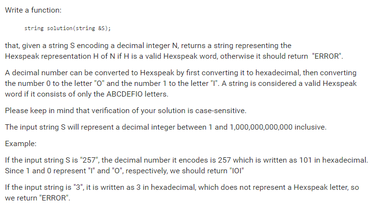

# Codility Convert Decimal To Hexspeak

### Codility

## Question



## Solution

* C++1
```
#include<cstring>

string convertDecimalToHexspeak(string & s){
    long num = stol(s, nullptr, 10);
    string res = "";
    while(num > 0){
        int digit = num % 16;
        if(digit > 1 && digit <=9) return "ERROR";
        num /= 16;
        if(digit == 0) res = "O" + res;
        else if(digit == 1) res = "I" + res;
        else res = string(1, 'A'+(digit-10)) + res;
    }
    return res;
}
```

## Explanation

1. convert string to long (**NOTE** 1,000,000,000,000 is larger than MAX_INT).
2. Convert each digit of hexadecimal.

* **worst-case time complexity:** O(log<sub>16</sub>(n))
* **worst-case space complexity:** O(1)

## Test cases

* `1`
* `1,000,000,000,000`
* `3`
* `257`
