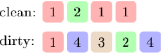

# Codility. Socks Laundering

### Codility

## Question

Bob is about to go on a trip. But first he needs to take care of his supply of socks. Each sock has its own color. Bob wants to take as many pairs of clean socks as possible (both socks in the pair should be of the same color).

Socks are divided into two drawers: clean and dirty socks. Bob has time for only one laundry and his washing machine can clean at most K socks. He wants to pick socks for laundering in such a way that after washing he will have a maximal number of clean, same-colored pairs of socks. It is possible that some socks cannot be paired with any other sock, because Bob may have lost some socks over the years.

Bob has exactly N clean and M dirty socks, which are described in arrays C and D, respectively. The colors of the socks are represented as integers (equal numbers representing identical colors).

For example, given four clean socks and five dirty socks:


 
If Bob's washing machine can clean at most K = 2 socks, then he can take a maximum of three pairs of clean socks. He can wash one red sock and one green sock, numbered 1 and 2 respectively. Then he will have two pairs of red socks and one pair of green socks.

**Write a function:**

`int solution(int K, vector<int> &C, vector<int> &D);`

that, given an integer K (the number of socks that the washing machine can clean), two arrays C and D (containing the color representations of N clean and M dirty socks respectively), returns the maximum number of pairs of socks that Bob can take on the trip.

**For example** 
```
given K = 2, C = [1, 2, 1, 1] and D = [1, 4, 3, 2, 4]

the function should return 3, as explained above.
```
**Assume that:**

* K is an integer within the range [0..50];
* each element of arrays C, D is an integer within the range [1..50];
* C and D are not empty and each of them contains at most 50 elements.

In your solution, focus on correctness. The performance of your solution will not be the focus of the assessment.

## Solutions

### Solution 1

* C++
```
int solution(int K, vector<int> &C, vector<int> &D) {
    // write your code in C++14 (g++ 6.2.0)
    int res = 0;
    vector<int> clean(51);
    vector<int> dirty(51);
    for(int c : C)
        clean[c]++;
    for(int d : D)
        dirty[d]++;
        
    for(int i= 1; i<51; ++i)
    {
        res += clean[i]/2;
        if(clean[i]%2!=0 && K>0 && dirty[i]>0)
        {
            res++;
            K--;
            dirty[i]--;
        }
    }
    
    for(int i=1; K>1 && i<51; ++i)
    {
        if(dirty[i] >=2)
        {
            dirty[i] = min(dirty[i]/2, K/2);
            res += dirty[i];
            K -= 2*dirty[i];
        }
    }
    return res;
}
```

1. Count the color in clean `C` and dirty `D`
2. Add paired socks in `clean` into result. If found odd number of socks in `clean`, check if we can find one in `dirty` and update `dirty`. Update K.
3. If K is still more than 1, search paired socks in `dirty` and add it to result.

**Note** the result is asking for `the number of pairs of socks` not the number of socks.

**Complexity:**

* **worst-case time complexity:** `O(max(c, d))`, where `c` is the length of `C`, `d` is the length of `D`.
* **worst-case space complexity:** `O(1)`.

## Testcase

smallest 

smallest possible tests


small_simple 

small simple tests, easy to solve even with heuristic approach


no_laundry 

tests where K = 0


odd_clean_with_odd_dirty 

tests causing solution that's only pairing clean socks of odd count with dirty socks of odd count to fail


saving_one_used_dirty_check 

tests causing solution that's not saving if dirty sock was used to pair with clean sock to fail


all_dirty 

there are no clean socks taken


all_clean 

there are no dirty socks taken after laundry


odd_even_dirty_check 

odd and even number of dirty socks which do not match with clean socks


random_few_colors 

randomly generated tests with only a couple of colors


maximal 

maximal possible test cases

