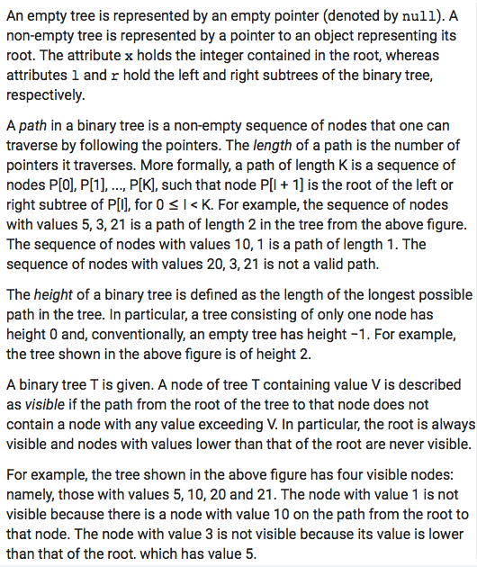
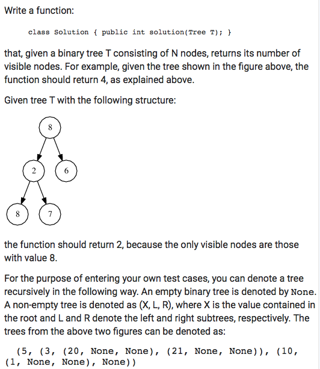
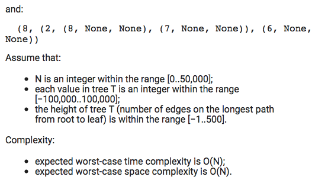

# Codility. Count Visible Nodes in Binary Tree

### Codility

## Question






## Solution

* Java1
```
class Solution {

    public int solution(Tree T) {
        if(T==null) return 0;
        return countVisible(T, T.x);
    }

    private int countVisible(Tree T, int max){
        if(T==null) return 0;
        if(T.x < max) {
            return countVisible(T.l, max) + countVisible(T.r, max);
        }
        else{
            return 1 + countVisible(T.l, T.x) + countVisible(T.r, T.x);
        }
    }
}
```

## Explanation

Recursive from root to leaves, keep the maximum value through each path:

1. null node --> return 0;
2. T.x < max --> recursive down without update the `max`
3. T.x >= max --> return 1 plus recursive down and update the 'max' with the `T.x`.

* **worst-case time complexity:** O(n)
* **worst-case space complexity:** O(h)
