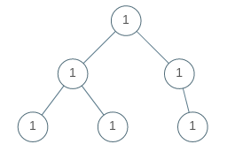
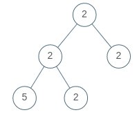

# LC965. Univalued Binary Tree

### LeetCode

## Question

A binary tree is univalued if every node in the tree has the same value.

Return true if and only if the given tree is univalued.
 
**Example 1:**

```
Input: [1,1,1,1,1,null,1]
Output: true
```

**Example 2:**

```
Input: [2,2,2,5,2]
Output: false
``` 

**Note:**

* The number of nodes in the given tree will be in the range [1, 100].
* Each node's value will be an integer in the range [0, 99].

## Solutions

* Scala2 (beat 16.67%)
```
def isUnivalTree(root: TreeNode): Boolean = {
    if(root == null) return true
    if(root.left != null && root.value != root.left.value) return false;
    if(root.right != null && root.value != root.right.value) return false;
    isUnivalTree(root.left) && isUnivalTree(root.right)
}
```

* Scala2 (beat 100%)
```
def isUnivalTree(root: TreeNode): Boolean = {
    if(root == null) return true
    else if(root.left != null && root.value != root.left.value) return false;
    else if(root.right != null && root.value != root.right.value) return false;
    else isUnivalTree(root.left) && isUnivalTree(root.right)
}
```

## Explanation

`else` can make the code much faster in the case.

* **worst-case time complexity:** `O(log(n))`, where `n` is the number of nodes int the tree.
* **worst-case space complexity:** `O(log(n))`, where `n` is the number of nodes int the tree.


