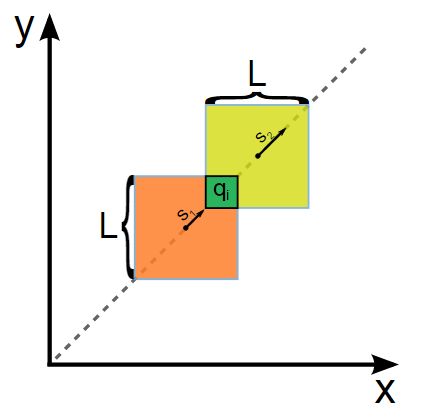

# Sherlock and Moving Tiles

### HackerRank

## Question

Sherlock is given 2 square tiles, initially both of whose sides have length L placed in an x-y plane; so that the bottom left corner of each square coincides with the the origin and their sides are parallel to the axes.

At t=0, both squares start moving along line y=x (along the positive x and y) with velocities S1 and S2.

For each query of form qi, Sherlock has to report the time at which the overlapping area of tiles is equal to qi.


 
**Note:** Assume all distances in meter, time in seconds and velocities in meter per second unless otherwise specified.

**Input Format**

First line contains integers L, S1, S2. Next line contains Q, the number of queries. Each of the next Q lines consists of one integer qi in one line.

**Constraints** 
* 1 <= L, S1, S2 <= 10<sup>9</sup>
* 1 <= Q <= 10<sup>5</sup>
* 1 <= qi <= L<sup>2</sup>

**Output Format**

For each query, print the required answer in one line. Your answer will be considered correct if it is at most 0.0001 away from the true answer. See the explanation for more details.

**Sample Input**
```
10 1 2
2
50
100
```

**Sample Output**
```
4.1421
0.0000
```

**Explanation**

For the first case, note that the answer is around 4.1421356237..., so any of the following will be accepted:
```
4.1421356237
4.14214
4.14215000
4.1421
4.1422
```

## Solution
* Java1
```bash
private static final double SQRT2 = Math.sqrt(2);
public static void main(String[] args) {
    Scanner sc = new Scanner(System.in);
    double L = sc.nextDouble();
    double S1 = sc.nextDouble();
    double S = Math.abs(sc.nextDouble() - S1);
    int Q = sc.nextInt();
    
    for(int i=0; i<Q; ++i){
        double q = sc.nextDouble();
        double res = (L-Math.sqrt(q))*SQRT2 / S;
        System.out.printf( "%.4f\n", res);
    }
}
```

## Explanation

This is a velocity, Time and Distance question. 

The question is to get the **time** when the overlapping area of tiles is equal to qi. So, Let's see what it looks like when the overlapping area of tiles is equal to qi.


We know the velocities (S1, S2), the moving direction (**along line y=x**). The tiles are two square tiles. It's clear we need the distance to divide the velocities to get the **time**. From the picture, we can see relative distance (**?**) between the two tiles.

First, we will find the distance `x`. We know the area of the overlapping area q<sub>i</sub>, so the edge `x` of the overlapping area is **sqrt(q<sub>i</sub>)**. 

Second, the diagnal's distance of the overlapping area is x * sqrt(2).

Third, the diagnal's distance of the slow tile is L * sqrt(2);

Then, we can get the relative distance between the two tiles (L * sqrt(2) - x * sqrt(2)).

Finally, we just need to use the relative distance divided by the relative velocity `(abs(S1 - S2))`.

Therefor, the final formula is **(L - sqrt(q<sub>i</sub>) * sqrt(2) / abs(S1 - S2))**.

