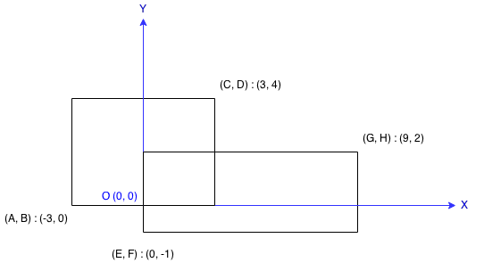

# LC223. Rectangle Area

### LeetCode

## Question

Find the total area covered by two rectilinear rectangles in a 2D plane.

Each rectangle is defined by its bottom left corner and top right corner as shown in the figure.
 


Assume that the total area is never beyond the maximum possible value of int.

## Solutions

* C++1
```
int computeArea(int A, int B, int C, int D, int E, int F, int G, int H) {
    int area1 = (C-A) * (D-B);
    int area2 = (G-E) * (H-F);
    if(E>=C || F>=D || G<=A || H<=B) return area1+area2;
    int shareArea = (min(D,H)-max(B,F))*(min(G,C)-max(A,E));
    return area1 + area2 - shareArea;
}
```

* C++2
```
int computeArea(int A, int B, int C, int D, int E, int F, int G, int H) {
    int areas = (C-A) * (D-B) + (G-E) * (H-F);
    if(E>=C || F>=D || G<=A || H<=B) return areas;
    return areas - (min(D,H)-max(B,F))*(min(G,C)-max(A,E));
}
```

## Explanation

**Cases:**

1. Area1 and Area2 have no overlapping area.
2. Area1 and Area2 have a overlapping area.

* **worst-case time complexity:** O(1)
* **worst-case space complexity:** O(1)