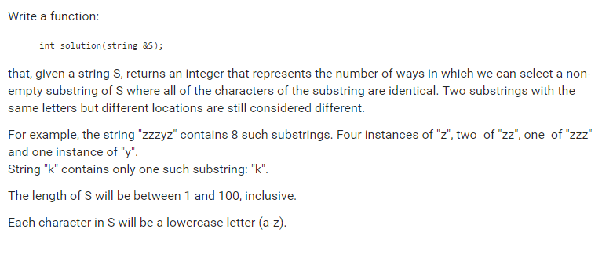

# Codility. Count Instances

### Codility

## Question



## Solutions

* C++1
```
int countInstances(string & s){
    int res = 0, count=1;
    s += "*";
    for(unsigned int i = 0; i<s.length()-1; ++i){
        while(s[i] == s[i+1]){
            i++;
            count++;
        }
        res += count*(count+1) / 2;
        count = 1;
    }
    return res;
}
```

## Explanation

The required substrings are all from identical substring. So we just need to count the lengths of all identical substring and calculate the number of combinatorics.

**NOTE** number of combinatorics = `count*(count+1) / 2`

* **worst-case time complexity:** O(n)
* **worst-case space complexity:** O(1)

## Test cases

* ``
* `a`
* `aa`
* `aaa`
* `aaaa`
* `aab`
* `abc`
