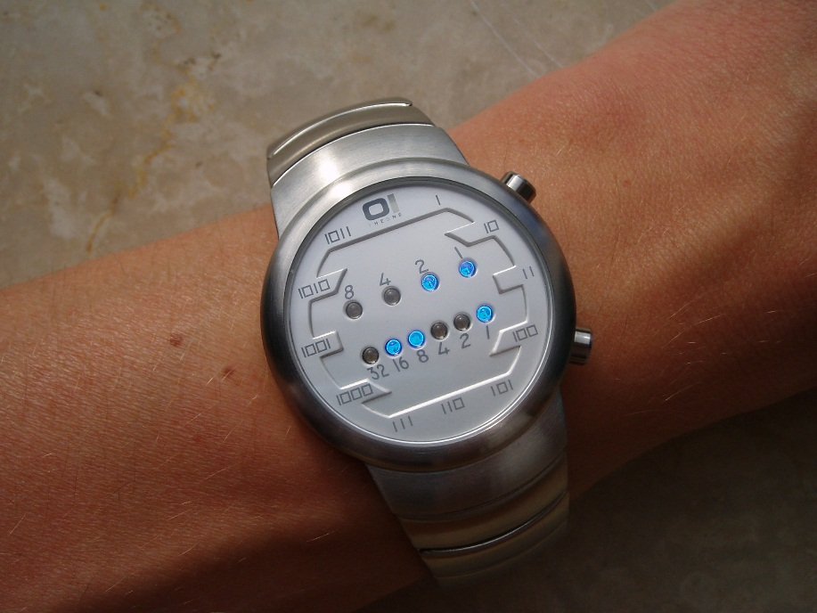

# LC401. Binary Watch

### LeetCode

## Question

A binary watch has 4 LEDs on the top which represent the hours (0-11), and the 6 LEDs on the bottom represent the minutes (0-59).

Each LED represents a zero or one, with the least significant bit on the right.



For example, the above binary watch reads "3:25".

Given a non-negative integer n which represents the number of LEDs that are currently on, return all possible times the watch could represent.

**Example:**

**Input:**
```
n = 1
```

**Return:** 
```
["1:00", "2:00", "4:00", "8:00", "0:01", "0:02", "0:04", "0:08", "0:16", "0:32"]
```

**Note:**

The order of output does not matter.

The hour must not contain a leading zero, for example "01:00" is not valid, it should be "1:00".

The minute must be consist of two digits and may contain a leading zero, for example "10:2" is not valid, it should be "10:02".

## Solutions

* C++1 (0ms)
```
class Solution {
public: 
    void TrackingRepresentTimes(vector<string>&res, int LEDs[], int num, int index, int hour, int minute)
    {
        if(hour>11 || minute>59) return;
        if(num == 0)
        {
            string aTime = to_string(hour) + ":" + ((minute < 10)? "0" : "") + to_string(minute);
            res.push_back(aTime);
            return;
        }
        for(int i=index; i<10; ++i)
        {
            if(i<4)
                TrackingRepresentTimes(res, LEDs, num-1, i+1, hour+LEDs[i], minute);
            else
                TrackingRepresentTimes(res, LEDs, num-1, i+1, hour, minute+LEDs[i]);
        } 
    }
    vector<string> readBinaryWatch(int num) {
        vector<string> res;
        int LEDs[] = {1,2,4,8, 1,2,4,8,16,32};
        TrackingRepresentTimes(res, LEDs, num, 0, 0,0);
        return res;
    }
};
```

* Java1 (3ms)
```
public class Solution {
    public List<String> readBinaryWatch(int num) {
        int[] LEDs = {1,2,4,8, 1,2,4,8,16,32};
        List<String> res = new ArrayList<String>();
        traceTime(res, LEDs, num, 0, 0, 0);
        return res;
    }
    private void traceTime(List<String> res, int[] LEDs, int num, int start, int hour, int minutes)
    {
        if(hour>11 || minutes>59) return;
        if(num == 0)
        {
            res.add(""+hour+":" + ((minutes<10) ? "0" : "" )+ minutes);
        }
        else
        {
            for(int i=start; i<10; ++i)
            {
                if(i<4) traceTime(res, LEDs, num-1, i+1, hour + LEDs[i], minutes);
                else    traceTime(res, LEDs, num-1, i+1, hour, minutes + LEDs[i]);
            }
        }
    }
}
```

## Explanation

Put on the num of LEDs on all possible positions, calculate the result.

Maximum result size: C(10, 5) = 252.

**NOTE** corner cases:
1. hour > 11
2. minutes > 59
3. minutes < 10, you must put `0` before it

* **worst-case time complexity:** O(2<sup>10</sup>)
* **worst-case space complexity:** O(2<sup>10</sup>).
