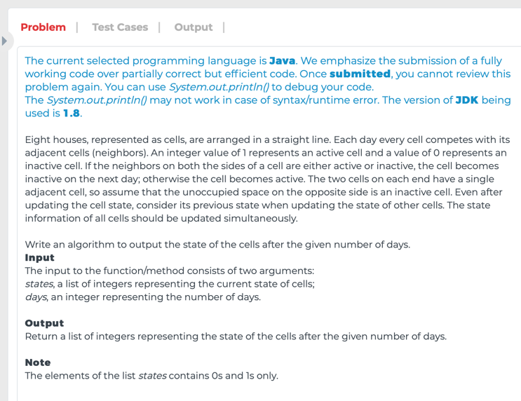

# WT. Eight Houses States

## Question



## Solutions

### Solution 1

* Java
```
public class Solution
{        
    private final int ACTIVE = 1;
    private final int INACTIVE = 0;
    
  // METHOD SIGNATURE BEGINS, THIS METHOD IS REQUIRED
    public List<Integer> cellCompete(int[] states, int days)
    {
    // WRITE YOUR CODE HERE
        int[] existStates = copyStates(states);
        
        updateStates(existStates, states, days);
        
        return arrayToList(states);
    }
    
    private int[] copyStates(int[] states){
        int n = states.length;
        int[] existStates = new int[n+2]; //Using two more spaces to simulate the two cells on each end
        for(int i=0; i<n; i++)
            existStates[i+1] = states[i];
        return existStates;
    }
    
    private void updateStates(int[] existStates, int[] states, int days){
        for(int i=0; i<days; i++){
            updateOneDayState(existStates, states);
                
            existStates = copyStates(states); //keep previous states
        }   
    }
    
    private void updateOneDayState(int[] existStates, int[] states){
        for(int j=0; j<states.length; j++)
            states[j] = (existStates[j] ^ existStates[j+2]) == 1 ? ACTIVE : INACTIVE; //use '^' to check if both neighbors are the same states
    }
    
    private List<Integer> arrayToList(int[] states){
        List<Integer> res = new ArrayList<>();
        for(int s : states)
            res.add(s);
        return res;
    }
  // METHOD SIGNATURE ENDS
}
```

When I see the question, I was thinking I need an extra space to store yesterday's state, so I can update today's state.

We can use two more spaces to simulate the two cells on each end, so that we don't need to worry about updating the states of the `house1` and `hourse8`.

After update one day states, copy the states to the extra space.

`existStates[j] ^ existStates[j+2]` is used to check if both neighbors are the same state.

**Complexity:**

* **worst-case time complexity:** `O(n * d)`, where `n` is the length of the input `states`, `d` is the number of days. 
* **worst-case space complexity:** `O(n)`, where `n` is the length of the input `states`.
