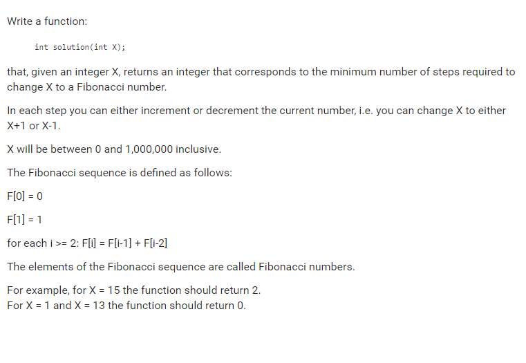

# Codility. Count Steps to Fibonacci

### Codility

## Question



## Solutions

* C++1

```
#include <algorithm>

int countStepsToFibonacci(int x){
    vector<int> fib(1, 0);
    fib.push_back(1);
    for(unsigned int i = 1; fib.back() < 1000000; ++i){
        fib.push_back(fib[i] + fib[i-1]);
    }
    int res = 1000000;
    for(int f : fib)
        res = min(res, abs(f - x));
    return res;
}
```

## Explanation

Find all fibonacci numbers in [0, 1000000].

Find the nearest fibonacci numbers from x.

* **worst-case time complexity:** O(log(n))
* **worst-case space complexity:** O(log(n))

## Test cases

[0, 1000000]