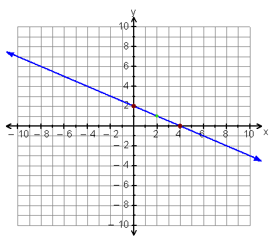

# Sumar and the Floating Rocks

### HackerRank

## Question

Famous wizard Sumar moonji kumaru is stuck in a huge room and has to save Hermione Granger from a monster. Kumaru is at location P1 given by integral coordinates (x1,y1) and Hermione is at location P2 given by integral coordinates (x2,y2). Sadly P1 and P2 are the only points at which floating rocks are present. Rest of the room is without floor and underneath is hot lava.

Kumaru has to go from P1 to P2 but there are no floating rocks to walk on.

Kumaru knows a spell that can make the rocks appear but only on the integral coordinates on the straight line joining P1 and P2.

How many rocks can appear at locations (x,y) on the line segment between P1 and P2 (excluding P1 and P2) which satisfy the condition that both x and y are integers?

**Input Format** 

The first line contains a single integer T, the number of test cases. T lines follow. 

Each of the following T lines contains one test case each. Each test case contains 4 integers x1, y1, x2 and y2separated by a single space.

**Output Format** 

A single line containing the number of rocks.

**Constraints** 

* 1 <= T <= 10<sup>5</sup>
* -10<sup>9</sup> <= x1, y1, x2, y2 <= 10<sup>9</sup>

**Sample input**
```
3
0 2 4 0
2 2 5 5
1 9 8 16
```

**Sample Output**
```
1
2
6
```

**Explanation**



* Case 1: As shown in the figure, between (0,2) and (4,0) there's only 1 integral point (2,1) hence 1 rock. 
* Case 2: Between (2,2) and (5,5) lies (3,3) and (4,4), hence 2 rocks. 
* Case 3: Between (1,9) and (8,16) there lies 6 rocks at positions (2,10) (3,11) (4,12) (5,13) (6,14) (7,15).

## Solutions
* Java1
```
public static void main(String[] args) {
        Scanner sc = new Scanner(System.in);
        int T = sc.nextInt();
        int[] p = new int[4];
        for(int i=0; i<T; ++i){
            for(int j=0; j<4; ++j)
                p[j] = sc.nextInt();
            int gcd = GCD(p[0]-p[2], p[1]-p[3]);
            System.out.println(Math.abs(gcd)-1);
        }
    }
    
    private static int GCD(int x, int y){
        return y==0 ? x : GCD(y, x%y);
    }
```

## explanation

