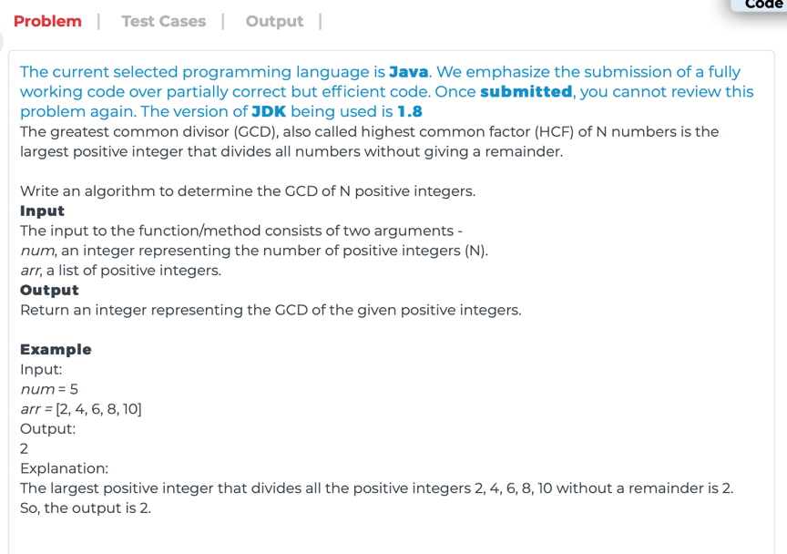

# WT. GCD of N Positive Integers

## Question



## Solutions

### Solution 1

* Java
```
class GCD
{
    // METHOD SIGNATURE BEGINS, THIS METHOD IS REQUIRED
    public int generalizedGCD(int num, int[] arr)
    {
        // WRITE YOUR CODE HERE
        if(num==1) return arr[0];
        int res = GCD(arr[0],arr[1]);
        for(int i=2; i<num&&res!=1; i++) //1 is the minimum possible GCD value of any positive integers
            res = GCD(res, arr[i]); //the GCD of all positive integers will be less or equal than the GCD of the sub sequence
        return res;
    }
    
    private int GCD(int a, int b){
        return b==0? a : GCD(b, a%b);
    }
    // METHOD SIGNATURE ENDS
}
```

The GCD of N Positive Integers can be computed by incrementally computing the GCD of two numbers:

`GCD(n1, n2, n3, ..., nx) = GCD(n1, GCD(n2, GCD(..., nx)))`

**Complexity:**

* **worst-case time complexity:** `O(n * log(n))`, where `n` is the length of the input `num`.
* **worst-case space complexity:** `O(1)`.